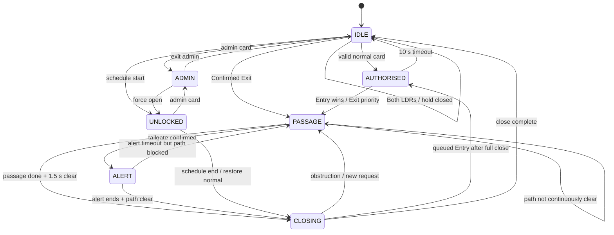

# Smart Door LDR / FSM 完整修改与时序报告

- **项目：** DESN2000 Smart Door
- **LDR/FSM 测试分支：** `FixLdr`
- **报告日期：** 2026-08-07
- **LDR/FSM 测试基线：** `43a9182 Fix simultaneous LDR request`
- **GitHub 发布基线：** `remove` 分支的 `e22b4b8`；该提交历史包含上述 `FixLdr` 基线
- **报告范围：** 从拉取 FixSchedule 后开始进行的 LDR/FSM 修改、时序分析和回归测试场景。

---

## 1. 最终结果摘要

最初版本已经能够读取两个 LDR 并按顺序判断 Entry/Exit，但仍存在以下核心问题：

1. 刷卡后门会立即打开，而不是等人真正到达 LDR1。
2. 通行过程中没有稳定的方向所有权，另一侧传感器可能改变门的方向。
3. 第二次触发 LDR1 就可能被当成尾随，人员尚未真正进入就报警。
4. 正常 Entry 中 LDR1/LDR2 重叠时，松开顺序可能导致提前关门或夹人。
5. Exit 完成后立即清除序列，无法继续识别有人借出门反向进入。
6. 刷卡前残留的 LDR 序列可能污染刷卡后的新授权。
7. 刷卡与 Exit 同时发生时，旧逻辑可能锁住 Exit，或者直接让门从 Exit 位置转向 Entry。
8. 两边同时遮挡时，Exit 锁定会丢掉原来的 simultaneous 状态，使结果依赖 L1/L2 松开的先后和 50 ms 防抖边界。
9. 两边有人时直接向 Exit 开门，会让 LDR2 一侧撤回后，LDR1 一侧的无卡人员利用已经打开的门进入。

当前版本已经形成如下完整规则：

- Entry 必须先有有效卡授权，再由 LDR1 真正启动开门。
- Exit 永远不需要卡。
- 在 Entry 尚未获得门的所有权前，Exit 优先。
- 一旦通行方向取得所有权，门不会因为另一侧传感器而直接反向旋转。
- 正向尾随必须等第二个人真正产生新的 LDR2 遮挡后才报警。
- Exit 后保留反向监视；L1 先出现、之后到达 LDR2，判定为未授权反向进入。
- 门关闭时两边真正同时请求，门保持关闭并提示 Entry 一侧退开；L1 先清空才向 Exit 开门，L2 先清空则只处理剩余的 Entry 请求。
- 两个 LDR 必须连续清空 1.5 秒才允许关门；关门途中任何遮挡都会立即重新开门。
- 无效卡蜂鸣器持续 2 秒；尾随报警蜂鸣器和闪灯持续 10 秒。

---

## 2. 硬件方向与符号约定

| 名称 | 物理位置 | 作用 |
|---|---|---|
| LDR1 | 门外侧 | Entry 的第一传感器 |
| LDR2 | 门内侧 | Exit 的第一传感器 |
| `DIR_ENTRY` | 进门方向 | 电机向 Entry 方向开门 |
| `DIR_EXIT` | 出门方向 | 电机向 Exit 方向开门 |
| BLOCK | 光路被挡 | 有人或物体处于传感器位置 |
| CLEAR | 光路清空 | 传感器前没有遮挡 |

基本方向序列：

- Entry：`LDR1 → LDR2`
- Exit：`LDR2 → LDR1`

本报告中的“同时”不是肉眼感觉同时，而是两个信号经过 50 ms 防抖后，在同一次 `ldr_poll()` 中成为稳定 BLOCK。

---

## 3. 从最初版本到当前版本的修改历史

### 阶段 0：FixSchedule 基线

**基线提交：** `c5fae4e`

**状态：** Scheduler 修改已经存在，LDR 仍主要依靠简单的边沿顺序工作。

基线 LDR 能够完成：

- ADC 读取；
- BLOCK/CLEAR 阈值判断；
- 50 ms 防抖；
- `LDR1 → LDR2` 判断 Entry；
- `LDR2 → LDR1` 判断 Exit；
- 五秒未完成序列超时。

基线的局限：

- FSM 与 LDR 状态机之间缺少“当前通行方向所有权”；
- 刷卡、开门、实际靠近传感器没有被分成三个阶段；
- 同时进出和尾随主要靠局部条件处理，边界情况下容易互相覆盖。

### 阶段 1：无效卡增加两秒蜂鸣器

**提交：** `999fb5f Add buzzer to invalid card`

修改内容：

- 无效卡除了 LCD 提示和 LED 闪烁，还调用 `buzzer_alert(2000)`。
- 两秒结束后通过 `IDLE_REVERT` 回到正常待机画面。

当前结果：

```text
无效卡
  → LCD: Invalid card
  → LED 闪烁
  → Buzzer 2 秒
  → IDLE / Scan card
```

### 阶段 2：增加通行方向所有权

**提交：** `ed5890b Add pass direction logic`

新增概念：

- `direction_locked`
- `locked_direction`
- `ldr_lock_direction(direction)`
- `ldr_unlock_direction()`

修改目的：

- FSM 一旦接受 Entry 或 Exit，该方向在当前通行和关门周期内拥有门；
- 另一侧传感器仍会更新，用于防夹，但不能让电机直接反向；
- 如果锁定方向与已经开始的 LDR 序列一致，保留已有序列；
- 如果不一致，依据当前稳定的 LDR 状态重新同步。

这一阶段解决了：

- Entry 开门后 LDR2 被遮挡，不再突然改成 Exit；
- Exit 开门后 LDR1 被遮挡，不再直接让门转向 Entry；
- 防夹重新开门时沿用已有方向。

这一阶段的中间问题：

- 当时刷卡成功就锁定 Entry，因此刷卡后、用户还没碰 LDR1 时，里面的人触发 LDR2 可能被忽略。这个问题后来由 100 ms 仲裁和“刷卡只保留授权”修复。

### 阶段 3：正向尾随改为“真正进入后才报警”

**提交：** `29d116c Fix tailgate logic`

旧问题：

- 第二个人只要再次遮挡 LDR1，就可能立即报警；
- 但第二个人可能只是站在门外、后退或让路，尚未通过门。

新增尾随候选状态：

1. 等待第一个人到达 LDR2；
2. 等待第一个人的 LDR2 清空；
3. 等待第二个人产生新的 LDR2 BLOCK；
4. 只有新的第二次 LDR2 BLOCK 才发出 `EVT_TAILGATE_DETECTED`。

结果：

- 第二次 LDR1 只建立候选，不立即报警；
- 第二个人退回门外，不报警；
- 第二个人真正跟随到达 LDR2，报警。

### 阶段 4：刷卡后不立即开门

**提交：** `8db2810 Fix motor status on auth`

旧问题：

- 正常卡一刷，电机立即向 Entry 开门；
- 与“刷卡取得授权、到达入口后才开门”的预期不一致。

修改后：

1. 刷卡只进入 `AUTHORISED`；
2. LCD 显示 `Access granted / Approach door`；
3. 门保持关闭；
4. LDR1 真正被遮挡后才启动 Entry 通行并开门；
5. 如果刷卡时人已经站在 LDR1，系统使用当前稳定状态，不要求先离开再踩一次。

### 阶段 5：Entry 重叠释放和连续清空防夹

**提交：** `3ebe8c2 Fix entry leave logic`

问题来源：

- 刷卡后人靠近门时，LDR1 和 LDR2 可能同时被身体遮挡；
- 如果 LDR2 先松开、LDR1 后松开，简单状态机会误认为通行结束；
- 门可能过早关闭，夹到仍在门区的人。

新增状态：

- `ENTRY_OVERLAP_WAIT_LDR1_CLEAR`
- `ENTRY_AMBIGUOUS_WAIT_CLEAR`

处理规则：

- Entry 正常重叠时，只有 LDR1 先清空，才进入等待 LDR2 清空的正常完成路径；
- 如果 LDR2 先清空，进入 ambiguous 状态；
- ambiguous 状态必须等两个 LDR 全部清空，才取消这次不明确序列；
- FSM 仍会继续执行连续清空检查，不会立即关门。

同时增加：

- `ldr_path_has_been_clear_for(duration_ms)`；
- 两个 LDR 连续 CLEAR 1.5 秒后才允许关门；
- 每 100 ms 重新检查一次；
- 任何新遮挡都会重新计算 1.5 秒。

附带清理：

- `.gitignore` 增加 `.DS_Store`；
- 删除已经被 Git 跟踪的项目内 `.DS_Store`。

### 阶段 6：Exit 后增加反向尾随监视

**提交：** `472491a Fix inverse tailgating`

旧问题：

- 正常 Exit 完成后，LDR 序列立即重置；
- 如果门尚未完全关闭，有人从外侧利用已打开的门进入，系统可能没有报警。

新增状态：

- `EXIT_GUARD`
- `REVERSE_ENTRY_WAIT_LDR1_CLEAR`
- `REVERSE_ENTRY_WAIT_LDR2_BLOCK`

修改后：

- Exit 完成后不立即回到普通 IDLE LDR 状态；
- 在门完全关闭前保留 `EXIT_GUARD`；
- 新 LDR2 首先出现，视为另一个合法 Exit；
- 新 LDR1 首先出现，视为反向 Entry 候选；
- 候选随后到达 LDR2，触发尾随报警；
- 只有 LDR1 但没有到达 LDR2，五秒后取消候选并返回 `EXIT_GUARD`。

同时修复：

- 反向候选发生在关门阶段时，只重新打开到原来的 Exit 位置；
- 不允许门从 Exit 的 `-90°` 直接跨越中心转向 Entry 的 `+90°`。

### 阶段 7：清理刷卡前残留、增加 Entry/Exit 仲裁

**提交：** `c91e1fa Fix ldr memory status`

#### 7.1 清理刷卡前残留序列

旧边界：

```text
刷卡前：LDR1 BLOCK → CLEAR
LDR 内部仍在等待 LDR2
之后刷卡
再次触发 LDR1
第二次 LDR1 可能被当成旧序列中的第二个人
```

修复：

- 每次进入 `AUTHORISED` 都调用 `ldr_unlock_direction()`；
- `ldr_unlock_direction()` 无条件重置未完成序列；
- 物理稳定状态仍保留，所以刷卡时已经站在 LDR1 的情况仍然能够被识别。

#### 7.2 刷卡不再立刻锁死 Exit

新增 100 ms Entry 仲裁：

1. 刷卡只保存一个 `ENTRY_AUTH_AVAILABLE`；
2. LDR1 被遮挡后进入 `Checking doorway / Exit has priority`；
3. 等待 100 ms；
4. 如果期间 LDR2 出现，Exit 获得优先级；
5. 如果 100 ms 后 LDR1 仍被遮挡，Entry 获得门的所有权并开门；
6. 如果 LDR1 已经退回，清除这次候选，但保留卡授权并重新等待。

#### 7.3 同时请求不再直接从 Exit 转向 Entry

旧逻辑：

- Exit 完成后可能直接调用 `motor_open(DIR_ENTRY)`；
- 门可能从 `-90°` 穿过中心直接转到 `+90°`，产生约 180° 行程。

新逻辑：

1. Exit 优先；
2. 有效 Entry 授权保存为 `authorised_entry_queued`；
3. Exit 完成；
4. 两个 LDR 连续清空；
5. 门先关回中心；
6. 关门完成后重新进入 `AUTHORISED`；
7. Entry 人员重新靠近 LDR1后，门再向 Entry 打开。

#### 7.4 主循环顺序调整

旧顺序：先处理 FSM 定时器，再读取 LDR。

新顺序：

```text
ldr_poll()
  → dispatch LDR event
  → fsm_poll()
  → scheduler/keypad/NFC
```

作用：

- 100 ms 仲裁边界先看最新 LDR；
- 关门定时到期前先看门区是否安全；
- 减少“同一轮刚遮挡但定时器先作出决定”的竞争条件。

### 阶段 8：最终同时请求与反向报警补丁

**提交：** `cbaa427 Fix ldr missing alarm after exit problem`

**状态：** 已提交并同步至 `origin/FixLdr`；已完成 Clean Build。

#### 8.1 保留真正的 simultaneous 状态

旧问题：

```text
LDR1 + LDR2 同时 BLOCK
  → LDR_SEQUENCE_SIMULTANEOUS_WAIT_CLEAR
  → FSM 决定 Exit 优先
  → ldr_lock_direction(DIR_EXIT)
  → simultaneous 状态被重置成普通 Exit
```

这样会导致：

- LDR1 先松、LDR2 后松时，普通 Exit 状态可能仍在等待新的 LDR1；
- 五秒后产生 `EVT_PASSAGE_CANCELLED`；
- LCD 停在 `Safety check / Waiting to close`；
- 后续反向 Entry 边沿可能被旧 Exit 序列吸收。

修复后：

- `LDR_SEQUENCE_SIMULTANEOUS_WAIT_CLEAR` 被视为一个有效的 Exit-owned 序列；
- `ldr_lock_direction(DIR_EXIT)` 不再清除它；
- 不关心 LDR1、LDR2 谁先松开；
- 两个 LDR 全部 CLEAR 后发出 `EVT_PASSAGE_DONE`；
- 随后进入 `EXIT_GUARD`，继续监视反向进入直到完全关门。

#### 8.2 反向尾随按明确边沿顺序判断

旧问题：

- Exit 完成后，如果 LDR1 先出现；
- 随后 LDR2 出现，但此时 LDR1 仍然 BLOCK；
- 旧代码把它重新解释为 simultaneous，并给 Exit 优先；
- 快速的反向进入因此不报警。

修复后：

- 如果 LDR1 已经在更早的一次 polling 中稳定 BLOCK，之后才出现 LDR2，则方向已明确为 Entry；
- 不论 LDR1 此时是否已经 CLEAR，都触发反向尾随报警；
- 只有 LDR1/LDR2 在 `EXIT_GUARD` 的同一轮稳定 BLOCK，才使用 Exit 优先。

#### 8.3 修复快速授权 Entry 被误分配为 Exit

旧边界：

- 刷卡后进入 100 ms 仲裁；
- 人员快速完成 LDR1→LDR2；
- LDR 发出 `EVT_ENTRY_CONFIRMED`；
- AUTHORISED 旧分支将该事件和 Exit/Both 放在一起，可能向 Exit 开门。

修复后：

- `EVT_EXIT_REQUEST` 与 `EVT_BOTH_LDRS_BLOCKED`：Exit 优先；
- `EVT_ENTRY_CONFIRMED`：立即消费 Entry 授权、锁定 Entry、向 Entry 开门。

### 阶段 9：门关闭时的双方等待仲裁

**状态：** 当前工作区补丁，尚未提交；已完成 Clean Build。

发现的新漏洞：

```text
无卡，LDR1 + LDR2 同时 BLOCK
  → 门立即向 Exit 打开
  → LDR2 一侧人员撤回
  → LDR1 一侧无卡人员利用已经打开的门进入
```

根本原因是系统在两个方向都没有让开时就提前启动电机。新规则改为：

1. 门关闭且没有方向所有权时，LDR1/LDR2 同时请求不会开门；
2. LCD 显示 `Exit priority / Entry step back`；
3. 双方都保持 BLOCK 时，电机保持关闭位置；
4. LDR1 先 CLEAR 且 LDR2 保持 BLOCK 100 ms，确认 Entry 一侧退开，才向 Exit 开门；
5. LDR2 先 CLEAR 且 LDR1 保持 BLOCK 100 ms，确认 Exit 一侧撤回；有卡时允许 Entry，无卡时门保持关闭并显示 `Entry denied / Scan card`；
6. 两边都 CLEAR 时取消冲突请求；
7. 普通 LDR2 Exit 请求也先观察 100 ms，避免两个实际同时按下的信号因为防抖相差一个循环而提前开门；
8. 该等待只用于门尚未打开的初始请求。门已经打开或正在关门时，仍以防夹和当前方向所有权优先。

同时收紧了一个旧边界：LDR1 候选退开后再出现 LDR2 时，LDR 层仍保留 `L1 → L2` 的物理顺序；顶层根据当前是否已授权作决定。`AUTHORISED` 中按快速 Entry 处理，`IDLE` 中则不让旧 LDR1 残留阻塞无需刷卡的 Exit。

---

## 4. 当前系统的三层结构

当前逻辑分为三个相互配合的层次。

### 4.1 传感器层

负责：

- ADC 读取；
- 阈值和迟滞；
- 50 ms 防抖；
- 产生稳定 BLOCK/CLEAR 边沿；
- 记录两个 LDR 连续清空时间。

阈值：

| 参数 | 当前值 |
|---|---:|
| LDR1 BLOCK 阈值 | ADC ≤ 900 |
| LDR1 CLEAR 阈值 | ADC ≥ 1200 |
| LDR2 BLOCK 阈值 | ADC ≤ 900 |
| LDR2 CLEAR 阈值 | ADC ≥ 1200 |
| 防抖 | 50 ms |

900 到 1200 之间使用上一次稳定状态，避免 ADC 在临界值附近反复跳动。

### 4.2 LDR 通行序列层

负责：

- 根据 LDR1/LDR2 边沿先后判断方向；
- 识别同时请求；
- 识别正向尾随和反向尾随；
- 识别通行完成或未完成超时；
- 在方向锁定后禁止另一侧抢占。

### 4.3 顶层 FSM

负责：

- 卡权限；
- Entry/Exit 优先级；
- 电机开关方向；
- LCD、LED、蜂鸣器；
- 关门安全检查；
- Schedule、Admin 和常开模式。

---

## 5. 当前顶层 FSM 状态

| 状态 | 含义 | 主要行为 |
|---|---|---|
| `IDLE` | 正常待机 | 等卡、等 Exit、等 Schedule Start |
| `AUTHORISED` | 已取得一次 Entry 权限 | 门仍关闭，等 LDR1；Exit 仍可优先 |
| `PASSAGE` | 门已被一个方向拥有 | 开门、监视通行、尾随和安全 |
| `ALERT` | 尾随报警 | 保持门开、蜂鸣、闪灯、继续监视门区 |
| `CLOSING` | 电机正在关门 | 任何 LDR 遮挡立即重新开门 |
| `ADMIN` | 管理员菜单 | 设置时间、Schedule、常开等 |
| `UNLOCKED` | Schedule/Admin 常开 | 门保持打开，结束后安全关门 |

状态关系概览：



---

## 6. 当前 Entry 授权状态

| 状态 | 含义 |
|---|---|
| `ENTRY_AUTH_NONE` | 没有 Entry 权限 |
| `ENTRY_AUTH_AVAILABLE` | 有一张有效卡提供的一次 Entry 权限 |
| `ENTRY_AUTH_USED` | 该次权限已经被第一个确认进入的人使用 |

另外还有：

- `authorised_entry_queued = true`：同时请求中 Exit 先走，Entry 权限排队等待门完全关闭。

授权的关键规则：

1. 刷卡本身不代表已经通过；
2. LDR1 只代表有人准备进入；
3. LDR2 确认 Entry 方向并消费授权；
4. 第二个人再次到达新的 LDR2 时，没有第二份授权，因此报警。

---

## 7. 当前 LDR 内部状态

### 7.1 Entry 状态

| 状态 | 含义 |
|---|---|
| `ENTRY_WAIT_LDR1_CLEAR` | LDR1 已遮挡，等待人员离开 LDR1 |
| `ENTRY_WAIT_LDR2_BLOCK` | LDR1 已清空，等待人员到达 LDR2 |
| `ENTRY_WAIT_LDR2_CLEAR` | LDR2 已遮挡，等待人员离开门区 |
| `ENTRY_OVERLAP_WAIT_LDR1_CLEAR` | Entry 通行中 LDR1/LDR2 重叠，等待正确释放顺序 |
| `ENTRY_AMBIGUOUS_WAIT_CLEAR` | LDR2 先松导致方向不明确，等待全清 |

### 7.2 Exit 状态

| 状态 | 含义 |
|---|---|
| `EXIT_ARBITRATION` | 门关闭且只检测到 LDR2，观察 100 ms 是否有 LDR1 加入 |
| `EXIT_WAIT_LDR2_CLEAR` | LDR2 已遮挡，等待离开 LDR2 |
| `EXIT_WAIT_LDR1_BLOCK` | LDR2 已清空，等待到达 LDR1 |
| `EXIT_WAIT_LDR1_CLEAR` | LDR1 已遮挡，等待完全离开门区 |

### 7.3 Exit 后反向监视

| 状态 | 含义 |
|---|---|
| `EXIT_GUARD` | Exit 完成，但门还未完全关；继续监视 |
| `REVERSE_ENTRY_WAIT_LDR1_CLEAR` | Exit 后发现新的 LDR1，反向 Entry 候选 |
| `REVERSE_ENTRY_WAIT_LDR2_BLOCK` | 候选已离开 LDR1，等待是否到达 LDR2 |

### 7.4 同时请求

| 状态 | 含义 |
|---|---|
| `SIMULTANEOUS_WAIT_CLEAR` | 门关闭时双方请求冲突，保持门关闭并等待一侧退开 |
| `SIMULTANEOUS_LDR1_CLEAR_CONFIRM` | LDR1 已退开，确认 LDR2 单独保持 100 ms 后授权 Exit |
| `SIMULTANEOUS_LDR2_CLEAR_CONFIRM` | LDR2 已退开，确认 LDR1 单独保持 100 ms 后处理 Entry |

### 7.5 正向尾随

| 状态 | 含义 |
|---|---|
| `TAILGATE_WAIT_FIRST_LDR2_BLOCK` | 第二个人已触发 LDR1，但第一个人还没到 LDR2 |
| `TAILGATE_WAIT_LDR2_CLEAR` | 等待第一个人的 LDR2 清空 |
| `TAILGATE_WAIT_SECOND_LDR2_BLOCK` | 等待第二个人产生新的 LDR2 BLOCK |
| `TAILGATE_WAIT_CLEAR` | 已报警，等待物理门区清空 |

---

## 8. 当前关键时间参数

| 参数 | 当前值 | 作用 |
|---|---:|---|
| LDR 防抖 | 50 ms | 信号必须稳定后才形成边沿 |
| Entry 仲裁 | 100 ms | LDR1 后短暂等待可能出现的 Exit |
| 普通 Exit 近同时观察 | 100 ms | LDR2 单独触发后等待可能随后稳定的 LDR1 |
| 同时请求释放确认 | 100 ms | 一侧退开后，确认另一侧仍稳定保持 |
| 不完整 LDR 序列超时 | 5 s | 候选未继续时清理 |
| Entry 授权等待 | 10 s | 刷卡后一直不靠近则授权失效 |
| Passage/FSM 安全等待 | 10 s | 重新开门后的最长普通等待 |
| 连续安全清空 | 1.5 s | 两个 LDR 持续清空后才关门 |
| 关门重查 | 100 ms | 尚不安全时重复检查 |
| 电机关门预计行程 | 2.5 s | CLOSING 状态定时 |
| 无效卡报警 | 2 s | 蜂鸣器与 LED 提示 |
| 尾随报警 | 10 s | 蜂鸣器和 LED 闪烁 |

注意：一旦人员已经到达第二个 LDR，系统不会用五秒超时强制关门，而是等待门区真正清空。

---

## 9. 当前完整正常 Entry 时序

### 9.1 标准 Entry

```text
初始：IDLE，门关闭，L1=CLEAR，L2=CLEAR

有效卡
  → AUTHORISED
  → entry_auth = AVAILABLE
  → 清理刷卡前残留序列
  → LCD: Access granted / Approach door
  → 门不动

LDR1 BLOCK（稳定 50 ms）
  → EVT_ENTRY_REQUEST
  → 100 ms Entry 仲裁
  → LCD: Checking doorway / Exit has priority

100 ms 内没有 Exit，且 LDR1 仍 BLOCK
  → lock DIR_ENTRY
  → PASSAGE
  → motor_open(DIR_ENTRY)
  → LCD: Please pass

LDR1 CLEAR
  → 等待 LDR2

LDR2 BLOCK
  → EVT_ENTRY_CONFIRMED
  → entry_auth = USED

LDR2 CLEAR，且两个 LDR 均 CLEAR
  → EVT_PASSAGE_DONE

连续 CLEAR 1.5 s
  → CLOSING
  → motor_close()

关门 2.5 s 完成
  → IDLE
  → 解锁方向、清理序列
```

### 9.2 刷卡时已经站在 LDR1

```text
LDR1 已经稳定 BLOCK
  → 刷有效卡
  → 清理旧序列，但保留物理稳定状态
  → 立即开始同样的 100 ms 仲裁
  → 无 Exit 时向 Entry 开门
```

人员不需要退开再重新踩 LDR1。

### 9.3 快速 Entry：100 ms 内已经到达 LDR2

```text
刷卡
  → LDR1 BLOCK
  → 进入 100 ms 仲裁
  → LDR1 后出现 LDR2
  → EVT_ENTRY_CONFIRMED
  → 消费授权
  → lock DIR_ENTRY
  → motor_open(DIR_ENTRY)
```

当前补丁保证这一事件不会再被送到 Exit 分支。

### 9.4 LDR1 触发后人员后退

```text
刷卡
  → LDR1 BLOCK
  → 进入 100 ms 仲裁
  → LDR1 在仲裁结束前 CLEAR
  → 清理该候选
  → 授权仍 AVAILABLE
  → 重新显示 Access granted / Approach door
```

不会开门，也不会浪费这次授权。

---

## 10. 当前完整正常 Exit 时序

```text
初始：IDLE，门关闭

LDR2 BLOCK
  → 100 ms 近同时观察
  → 期间没有 LDR1 加入
  → EVT_EXIT_REQUEST
  → PASSAGE
  → lock DIR_EXIT
  → motor_open(DIR_EXIT)
  → LCD: Exit / Door opening

LDR2 CLEAR
  → 等待 LDR1

LDR1 BLOCK
  → 确认 Exit 方向

LDR1 CLEAR，且两个 LDR 均 CLEAR
  → EXIT_GUARD
  → EVT_PASSAGE_DONE

连续 CLEAR 1.5 s
  → CLOSING

关门 2.5 s 完成
  → IDLE
  → 解除 EXIT_GUARD
```

Exit 不检查卡，也不会消费 Entry 授权。

---

## 11. 当前同时请求时序

### 11.1 无卡，两边真正同时遮挡

```text
IDLE
  → LDR1 和 LDR2 同轮稳定 BLOCK
  → EVT_BOTH_LDRS_BLOCKED
  → 门保持关闭
  → LCD: Exit priority / Entry step back
  → 等待一侧稳定退开
```

如果 LDR1 先清空：

```text
LDR1 CLEAR，LDR2 仍 BLOCK，持续确认 100 ms
  → 说明 Entry 一侧已经让开
  → lock DIR_EXIT
  → motor_open(DIR_EXIT)
  → 正常 Exit 时序
```

如果 LDR2 先清空：

```text
LDR2 CLEAR，LDR1 仍 BLOCK，持续确认 100 ms
  → 说明 Exit 一侧已经撤回
  → 只剩无授权 Entry
  → 门保持关闭
  → LCD: Entry denied / Scan card
```

如果两边都清空：

```text
LDR1 CLEAR + LDR2 CLEAR
  → 取消 simultaneous request
  → IDLE
  → 门保持关闭
```

### 11.2 已刷卡，同时出现 Entry 和 Exit

开始时门仍保持关闭，LCD 提示 Entry 退开。

如果 LDR1 先清空、LDR2仍被挡：

```text
→ Exit 获得优先级并开门
→ authorised_entry_queued = true
→ Exit 完成后门关回中心
→ 恢复 AUTHORISED
→ Entry 人员重新触发 LDR1后进入
```

如果 LDR2 先清空、LDR1仍被挡：

```text
→ Exit 请求已经撤回
→ Entry 授权仍 AVAILABLE
→ 100 ms Entry 仲裁
→ 向 Entry 开门
```

如果双方都不退开，门始终不动。

### 11.3 普通 Exit 的近同时保护

单独看到 LDR2 后不会在同一时刻立刻启动电机，而是先观察 100 ms：

```text
只有 LDR2 保持 BLOCK
  → 100 ms 后确认普通 Exit并开门

100 ms 内 LDR1也变成 BLOCK
  → 转入 simultaneous hold
  → 门保持关闭
```

---

## 12. 当前正向尾随时序

目标：一张卡只允许一个 Entry 人员。

### 12.1 第二个人在第一个人到达 LDR2 前踩 LDR1

```text
人员 A：有效卡 → LDR1 → 门向 Entry 打开
人员 A：LDR1 CLEAR，尚未到 LDR2

人员 B：LDR1 BLOCK
  → 只建立 Tailgate Candidate
  → 不报警

人员 A：LDR2 BLOCK
  → 消费唯一授权

人员 A：LDR2 CLEAR
  → 等待新的 LDR2 BLOCK

人员 B：LDR2 BLOCK
  → EVT_TAILGATE_DETECTED
  → ALERT
```

### 12.2 第一个人已经挡住 LDR2时，第二个人踩 LDR1

```text
人员 A：LDR2 BLOCK
人员 B：LDR1 BLOCK
  → 候选，不立即报警

人员 A：LDR2 CLEAR
人员 B：产生新的 LDR2 BLOCK
  → 报警
```

### 12.3 第二个人只靠近但没有进去

```text
人员 B：LDR1 BLOCK → CLEAR
之后没有新的 LDR2 BLOCK
  → 五秒后候选取消
  → 不报警
```

因此，当前正向尾随判定是“第二个人真正到达 LDR2”，而不是“第二个人碰过 LDR1”。

---

## 13. 当前反向尾随时序

目标：有人正常出门后，防止门关闭前有人从外侧无卡进入。

### 13.1 标准反向尾随

```text
人员 A：正常 Exit 完成
  → EXIT_GUARD 保留

人员 B：LDR1 BLOCK
  → 反向 Entry 候选
  → 保持/重新打开到 DIR_EXIT，避免夹人和 180° 反转

人员 B：LDR2 BLOCK
  → 无论此时 LDR1 仍 BLOCK 或已经 CLEAR
  → EVT_TAILGATE_DETECTED
  → ALERT
```

### 13.2 候选人员后退

```text
Exit 完成
  → LDR1 BLOCK → CLEAR
  → 没有 LDR2 BLOCK
  → 五秒超时
  → 返回 EXIT_GUARD
  → 不报警
```

### 13.3 连续合法 Exit

```text
第一个 Exit 完成 → EXIT_GUARD
第二个人从内侧先触发 LDR2
  → 判定为另一个 Exit
  → 允许
```

### 13.4 EXIT_GUARD 中真正同轮同时遮挡

如果 LDR1/LDR2 在同一 polling 周期稳定 BLOCK：

- LDR2 分支优先；
- 判定为 Exit；
- 不立即报警。

如果 LDR1 已经在上一轮稳定 BLOCK，下一轮才出现 LDR2：

- 方向已经明确为 Entry；
- 判定反向尾随并报警。

---

## 14. 关门安全与重新开门流程

### 14.1 关门前安全检查

```text
收到 PASSAGE_DONE / PASSAGE_CANCELLED / FSM TIMEOUT
  → 检查两个 LDR 是否连续 CLEAR 1.5 s

否
  → PASSAGE
  → LCD: Safety check / Waiting to close
  → 100 ms 后再检查

是
  → CLOSING
  → motor_close()
```

### 14.2 关门途中出现遮挡

主循环每次先更新 LDR，再处理 FSM 定时器。

```text
CLOSING
  → 任意 LDR BLOCK
  → 立即回到 PASSAGE
  → 按 passage_direction 重新开门
  → 启动 10 s 安全等待
```

方向规则：

- 原来是 Entry，就向 Entry 重新打开；
- 原来是 Exit 或 Exit 后反向候选，就向 Exit 重新打开；
- 不会因为反向候选直接让电机跨越 180°。

---

## 15. 报警流程

### 15.1 尾随报警

```text
EVT_TAILGATE_DETECTED
  → ALERT
  → 保持当前 passage_direction
  → motor_open(current direction)
  → LCD: !! ALERT !! / Tailgating
  → LED 每 200 ms 闪烁
  → Buzzer 10 s
```

报警期间：

- LDR 继续监视；
- 门保持打开，避免夹住正在通过的人；
- 管理员卡可以提前停止蜂鸣和闪灯；
- 十秒结束后仍必须等待门区连续安全清空，才允许关门。

### 15.2 无效卡报警

```text
Invalid card
  → LCD 提示
  → LED 闪烁
  → Buzzer 2 s
  → 返回 IDLE
```

无效卡不会打开门，也不会建立 Entry 授权。

---

## 16. 当前优先级规则

从高到低可以概括为：

1. **物理防夹优先：** 关门时任何遮挡立即重新开门。
2. **已确认尾随优先：** 进入 ALERT，门保持打开并报警。
3. **Exit 在未分配所有权前优先：** Exit 不需要授权，不能把里面的人困住。
4. **已经取得所有权的方向保持：** 不允许另一侧传感器直接反转电机。
5. **门关闭时真正同时请求先保持关门。** Entry 一侧退开后才让 Exit 获得优先级。
6. **同时请求中 LDR2 一侧先退开时，只处理剩余 Entry。** 无卡不开门，有卡才允许 Entry。
7. **明确 L1 先、L2 后按 Entry 处理。** 没有授权则报警。
8. **排队 Entry 必须等待 Exit 完成并完全关门。**

---

## 17. 修改前后核心对比

| 项目 | 最初版本 | 当前版本 |
|---|---|---|
| 刷卡 | 可能立即开门 | 只保存授权，LDR1 后才开门 |
| Entry/Exit 方向 | 可能被另一侧事件改变 | 一次通行只允许一个方向拥有门 |
| Exit 权限 | 基本支持 | 始终无需刷卡；普通 Exit 增加100 ms近同时确认 |
| 同时请求 | 两边有人就立即开门 | 双方都站着时门保持关闭；根据谁先退开分配方向 |
| 排队 Entry | 可能直接反转 180° | Exit 后关回中心，再恢复授权 |
| 正向尾随 | 第二次 LDR1 可能立即报警 | 第二个人产生新的 LDR2 才报警 |
| 反向尾随 | Exit 完成后容易漏检 | EXIT_GUARD 保持到完全关门 |
| 快速反向进入 | L1/L2 重叠时可能当成 Exit | 只要 L1 在较早轮次出现，后续 L2 即报警 |
| 刷卡前残留 | 可能污染新授权 | 进入 AUTHORISED 时无条件清理 |
| 关门条件 | 只看瞬间是否 CLEAR | 必须连续 CLEAR 1.5 s |
| 关门中遮挡 | 可能来不及处理 | 主循环先读 LDR，立即安全重开 |
| 无效卡 | LED/LCD | LED/LCD + 蜂鸣器 2 s |

---

## 18. 建议最终回归测试表

下表定义完整回归场景和预期结果。它是测试矩阵，不应在没有实机结果记录的情况下解读为所有项目均已通过；实际执行时应另外记录日期、测试人员、实际结果、Pass/Fail 和录像或照片证据。

| 编号 | 操作 | 预期结果 |
|---|---|---|
| E-01 | 有效卡，不碰 LDR | 门不开；10 s 后回 IDLE |
| E-02 | 有效卡，L1→L2 | 向 Entry 开；不报警；安全关门 |
| E-03 | 先站 L1 再刷卡 | 100 ms 仲裁后向 Entry 开 |
| E-04 | 刷卡，L1短暂遮挡后退 | 门不开；授权继续有效 |
| E-05 | 刷卡后门尚未打开时 L1/L2同时遮挡 | 门保持关闭并提示 Entry 退开 |
| E-06 | Entry 中 L1/L2 重叠，L1先松 | 正常完成，不夹人 |
| E-07 | Entry 中 L1/L2 重叠，L2先松 | 等两边全清，不提前关门 |
| X-01 | 无卡，L2→L1 | 正常 Exit，不报警 |
| X-02 | 连续两人各自 L2→L1 | 两次 Exit 均允许 |
| X-03 | Exit 过程中 L1/L2 有重叠 | 仍保持 Exit 方向 |
| S-01 | 无卡，两边同轮 BLOCK并持续保持 | 门不动；显示 Entry step back |
| S-02 | 无卡，同时请求后 L1先松、L2保持 | 100 ms后向 Exit 开门 |
| S-03 | 无卡，同时请求后 L2先松、L1保持 | 门保持关闭；显示 Entry denied |
| S-04 | 无卡，同时请求后两边都松 | 取消请求并回 IDLE，门不动 |
| S-05 | 刷卡后同时请求，L1先松 | Exit先走；关门后恢复Entry授权 |
| S-06 | 刷卡后同时请求，L2先松 | 向Entry开门 |
| S-07 | 单独LDR2，100 ms内LDR1也遮挡 | 不开门，转入双方等待 |
| T-01 | 一张卡，一人正常 Entry | 不报警 |
| T-02 | 第二个人只踩 L1后退 | 不报警 |
| T-03 | 第二个人在第一人后产生新的 L2 | 10 s 尾随报警 |
| R-01 | 正常 Exit 后，L1→CLEAR→L2 | 报警 |
| R-02 | 正常 Exit 后，L1仍 BLOCK 时 L2到达 | 报警 |
| R-03 | 正常 Exit 后，只踩 L1并后退 | 不报警；返回 EXIT_GUARD |
| R-04 | 正常 Exit 后，另一个人先踩 L2 | 作为连续 Exit 允许 |
| R-05 | 初始 L1/L2 同时；L1先松、L2后松；再 L1→L2 | 报警 |
| C-01 | 两边刚清空不足1.5 s | 不关门，显示 Safety check |
| C-02 | 清空1.5 s后关门 | 正常进入 CLOSING |
| C-03 | 关门途中遮挡 L1 | 立即按原方向重开 |
| C-04 | 关门途中遮挡 L2 | 立即按原方向重开 |
| A-01 | 尾随报警期间刷管理员卡 | 停止报警，安全关门 |
| B-01 | 无效卡 | 蜂鸣和闪灯2 s，不开门 |

重点录像测试：

1. `S-01`：证明双方都站着时电机不动。
2. `S-02/S-03/S-04`：证明系统按退开顺序分配方向或取消请求。
3. `R-02`：证明 L1 尚未松开时到达 L2 仍会报警。
4. `R-05`：复现并验证本次最终修复的原始边界。
5. `C-03/C-04`：证明关门防夹和重开方向正确。

---

## 19. 当前仍然存在的硬件与实现限制

这些不是本轮补丁引入的问题，但最终演示和报告中应诚实说明。

### 19.1 两个二进制传感器无法识别人员身份

系统只能看到 LDR1/LDR2 的稳定顺序，无法知道是谁遮挡，也无法区分：

- 一个人身体同时挡住两个 LDR；
- 两个人分别站在两侧；
- 两个人高度重叠、传感器之间始终没有 CLEAR 边沿。

因此采用明确政策：

- 门关闭且同轮同时稳定：保持关门，等待一侧退开；
- 同时请求中 LDR1 先清空：确认 Entry 一侧让开后授权 Exit；
- 同时请求中 LDR2 先清空：只保留 Entry 请求，无卡不开门；
- 方向已经取得所有权或正在关门：不使用上述停门仲裁，以方向保持和防夹为先。

### 19.2 连续遮挡无法精确计数人数

正向尾随要求第一人的 LDR2 先 CLEAR，再看到第二次 LDR2 BLOCK。如果两个人紧贴到传感器始终不清空，两个二进制 LDR 无法产生“第二个人”的新边沿。门会保持打开保证安全，但人数识别能力受硬件限制。

### 19.3 NFC polling 仍可能阻塞主循环

当前 LDR 每轮先读取，但 PN532 的卡轮询内部可能等待数百毫秒。非常短、恰好发生在 NFC 等待期间的 LDR 动作存在被延迟或错过的风险。正常人员通行远长于该时间，实际影响通常有限，但这是当前架构的剩余风险。

### 19.4 ADC 读取失败时保持旧状态

如果一次 ADC 读取失败，`ldr_poll()` 返回 `EVT_NONE`，不会更新稳定状态。系统没有独立的传感器故障报警或 fail-safe 状态。

### 19.5 电机位置是开环记录

门位主要依赖软件记录步数，没有限位开关或绝对位置反馈。反复堵转、失步或手动移动可能让软件门位和真实门位产生偏差。

### 19.6 Schedule 常开关门方向仍需实机重点验证

`enter_unlocked()` 会清理 LDR 并向 Entry 打开，但没有独立记录新的 `passage_direction`。Schedule 结束后的关门若被遮挡，安全重开使用最近一次保存的方向，因此应把 Schedule End + 遮挡纳入最终实机录像测试。

---

## 20. 版本基线与构建结果

### 已提交历史涉及的主要文件

- `SmartDoor/Core/Src/ldr.c`
- `SmartDoor/Core/Inc/ldr.h`
- `SmartDoor/Core/Src/fsmcore.c`
- `SmartDoor/Core/Src/main.c`
- `.gitignore`

### LDR/FSM 测试基线

- 分支：`FixLdr`
- 最终提交：`43a9182 Fix simultaneous LDR request`
- 主要修改文件：`SmartDoor/Core/Inc/ldr.h`、`SmartDoor/Core/Src/ldr.c`、`SmartDoor/Core/Src/fsmcore.c`

### GitHub 发布基线

- 最终分支：`remove`
- 最终提交：`e22b4b8 Merge branch 'remove' into 'main'`
- 关系：`e22b4b8` 的提交历史包含 `43a9182`
- 发布说明：`remove` 在 LDR/FSM 基线之后还包含管理菜单、Schedule、蜂鸣器、主循环、STM32 配置和 macOS 元数据清理等后续合并。

### 报告记录的最新构建

- 构建方式：STM32CubeIDE Headless Clean Build
- 配置：`SmartDoor/Debug`
- 结果：`0 errors, 0 warnings`
- 固件：`SmartDoor/Debug/SmartDoor.elf`
- 固件生成时间：2026-08-07 21:19:33
- 固件大小：text 53032 bytes，data 160 bytes，bss 2584 bytes

### GitHub 发布副本验证构建

- 验证日期：2026-08-30
- 源代码：`remove` 基线 `e22b4b8`，仅增加发布文档和忽略规则
- 构建方式：STM32CubeIDE Headless Clean Build
- 配置：`SmartDoor/Debug`
- 结果：`0 errors, 0 warnings`
- 固件：`SmartDoor/Debug/SmartDoor.elf`（构建产物由 `.gitignore` 排除）
- 固件大小：text 53160 bytes，data 160 bytes，bss 2584 bytes

注意：构建成功只能证明语法、链接和静态配置通过；LDR 的物理先后、ADC 阈值、电机实际方向和人员站位仍必须通过上述实机测试确认。

---

## 21. 最终当前流程的一句话总结

> 刷卡只提供一次 Entry 权限；LDR1 真正启动 Entry，LDR2确认授权被使用；门关闭时双方同时请求会保持关门并等待一侧退开，Entry退开后才让Exit优先开门；方向一旦锁定不会被另一侧直接反转；正向和反向尾随都必须到达方向对应的第二个传感器才报警；所有关门动作必须等待两个 LDR 连续清空，并在遮挡时立即安全重开。
